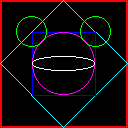

# A Graphics Programming Study

An effort to learn graphics programming from
[Computer Graphics, C Version, 2/e](http://www.prenhall.com/allbooks/esm_0135309247.html)
and perfect Rust idioms.

[PolyLine](src/poly_line.rs)s rendered into an image using the
📦[image](https://github.com/PistonDevelopers/image) crate.

# License

MIT license
